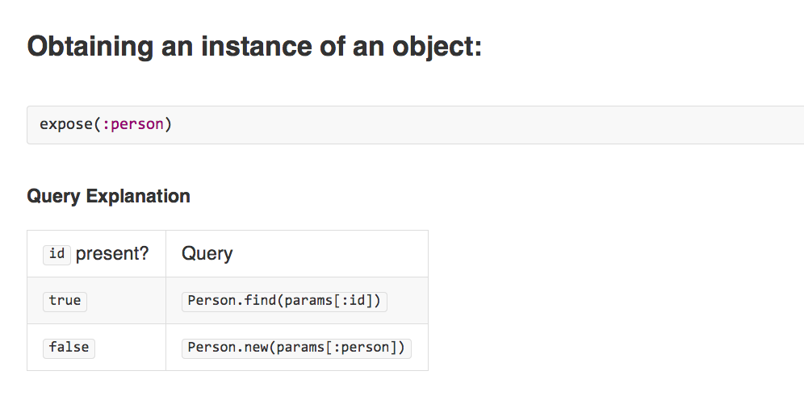

# decent-exposure-presentation

!SLIDE

####Clean up your Rails Controllers  with Decent Exposure
 
Name: **Ryan Jones**  
Position: **AMA - Manager, Web Development**    
Email: **ryan@system88.com**

!SLIDE left

## Overview  

* Rails Controllers + Instance Variables
* Decent Exposure Overview
* Controller Cleanup Example
* Environmental Awareness
* Customization (Strategies) 
* Questions? Comments?

!SLIDE left

## Rails Controllers + Instance Variables

* Instance variables are available to views via the controller

  
_app/controllers/posts_controller.rb_
@@@ ruby
def show
  @post = Post.find(params[:id])
end
@@@
 
_app/views/posts/show.html.erb_
@@@ ruby

  <strong>Title:</strong>
  <%= @post.title %>

 

  <strong>Text:</strong>
  <%= @post.text %>

@@@

!SLIDE left

## Rails Controllers + Instance Variables

* Breaks encapsulation
* Set in multiple places (helper, filter, action). Leads to: "where did this come from?" or "what is this?"

_app/controllers/posts_controller.rb_
@@@ ruby
def show
  @post = Post.find(params[:id])
  @text = @post.text
end
@@@
 
_app/views/posts/show.html.erb_
@@@ ruby

  <strong>Title:</strong>
  <%= @post.title %>

 

  <strong>Text:</strong>
  <%= @text %>

@@@

* Hard to stub instance variables while testing

!SLIDE left

## Decent Exposure Overview

Rails default scaffold
 
@@@ ruby
class PeopleController < ApplicationController
  before_action :set_person, only: [:show, :edit, :update, :destroy]

  def index
    @people = Person.all
  end

  def show
  end

  def new
    @person = Person.new
  end

  def edit
  end

  def create
    @person = Person.new(person_params)

    if @person.save
      redirect_to @person, notice: 'Person was successfully created.'
    else
      render action: 'new'
    end
  end

  def update
    if @person.update(person_params)
      redirect_to @person, notice: 'Person was successfully updated.'
    else
      render action: 'edit'
    end
  end

  def destroy
    @person.destroy
    redirect_to people_url, notice: 'Person was successfully destroyed.'
  end

  private
    def set_person
      @person = Person.find(params[:id])
    end

    def person_params
      params[:person]
    end
end

@@@

!SLIDE left

## Decent Exposure Overview cont.

decent_exposure controller
 
@@@ ruby
class PeopleController < ApplicationController
  expose(:person)

  def create
    if person.save
      redirect_to(person)
    else
      render :new
    end
  end

  def update
    if person.save
      redirect_to(person)
    else
      render :edit
    end
  end
  
  private
  
  def person_params # example of strong parameters
    params.require(:person).permit(:name)
  end
end
@@@

@@@ ruby

  <strong>Name:</strong>
  <%= person.name %>

@@@

!SLIDE left

## Decent Exposure - Magic explained

* Updates attributes, marks as dirty

@@@ ruby
class PeopleController
  expose(:person)

  def create
    if person.save
      redirect_to(person)
    else
      render :new
    end
  end
end
@@@

@@@ ruby
person.attributes = params[:person] # update_attributes(params[:person])
@@@

!SLIDE left

## Decent Exposure - Magic explained cont.

!SLIDE left

## Decent Exposure - Magic explained cont.

!SLIDE left

## Decent Exposure - Magic explained cont.

!SLIDE left

## Configuration

**Specify the model name:**

@@@ ruby
expose(:company, model: :enterprisey_company)
@@@

**Specify the parameter accessor method:**

@@@ ruby
expose(:company, params: :company_params)
@@@

**Specify the finder method (ie: reset password):**

@@@ ruby
expose(:article, finder: :find_by_slug)
@@@

**Specify the parameter key to use to fetch the object:**

@@@ ruby
expose(:article, finder_parameter: :slug)
@@@

**Off the beaten path (careful):**

@@@ ruby
expose(:environment) { Rails.env }
@@@

!SLIDE left

## Customization (Strategies) 

* strong_parameters

@@@ ruby

class ApplicationController < ActionController::Base
  decent_configuration do
    strategy DecentExposure::StrongParametersStrategy
  end
end

@@@

@@@ ruby
class PeopleController < ApplicationController
  expose(:person, attributes: :person_params)

  private
  def person_params
    params.require(:person).permit(:name)
  end
end
@@@

* person_params will only be called on a PUT, POST or PATCH request.

!SLIDE left

## Questions? Comments?

* Questions? Comments?
   
   
   
   
   
  

!SLIDE left

# Refs

* https://github.com/voxdolo/decent_exposure 
* http://decentexposure.info/

